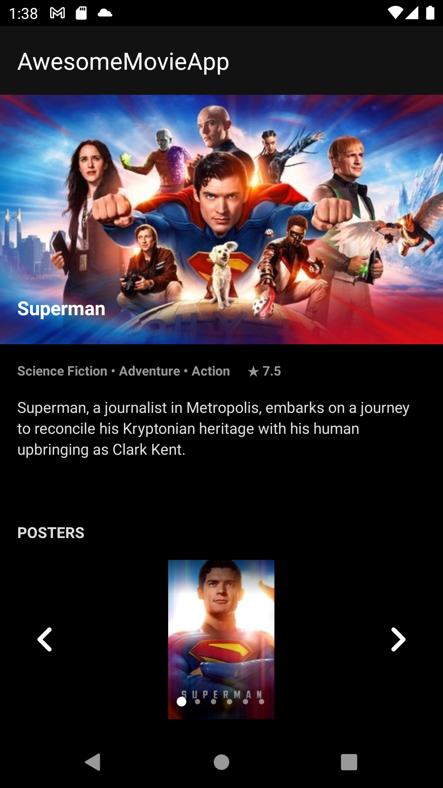

# AwesomeMovieApp

## Descrição

Aplicativo para consulta de filmes populares, exibição de detalhes e galeria de pôsteres, utilizando integração com a API do [The Movie Database](https://www.themoviedb.org/) (TMDB).

## Tecnologias utilizadas

- Kotlin
- MVVM
- LiveData
- ViewModel
- Retrofit
- Room
- Coroutines
- Data Binding
- Navigation Component
- Moshi
- Glide

## Screenshots

    
    

> [!TIP]
> 
> Para mais informações sobre a API utilizada, consulte a documentação oficial do TMDB:
> [The Movie Database API](https://developers.themoviedb.org/3/getting-started/introduction)
> 
> Para obtenção de chave de API e credenciais, visite:
> [The Movie Database API Key](https://www.themoviedb.org/settings/api)
