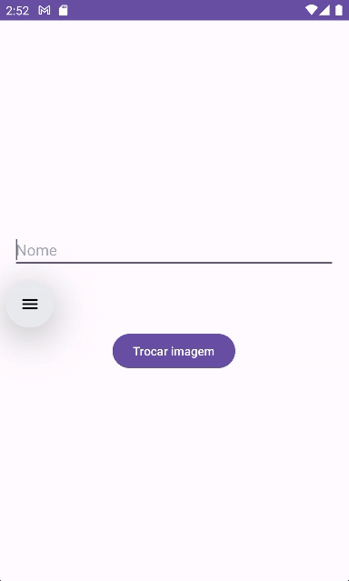

# BasicApp

## Descrição do projeto

Aplicativo Android simples para demonstração de interações básicas com interface, manipulação de textos e eventos de clique.

## Tecnologias utilizadas

- Kotlin
- View Binding

## Screenshots

    

