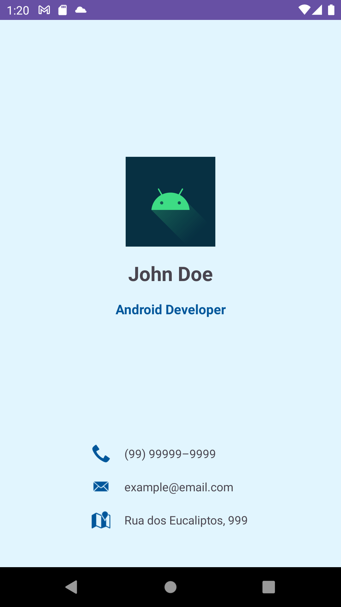

# BusinessCard

## Descrição do projeto

Aplicativo para exibição de um cartão de visita digital que contém informações de contato como nome, cargo, telefone, e-mail e endereço.

## Tecnologias utilizadas

- Kotlin
- View Binding

## Screenshots

    

