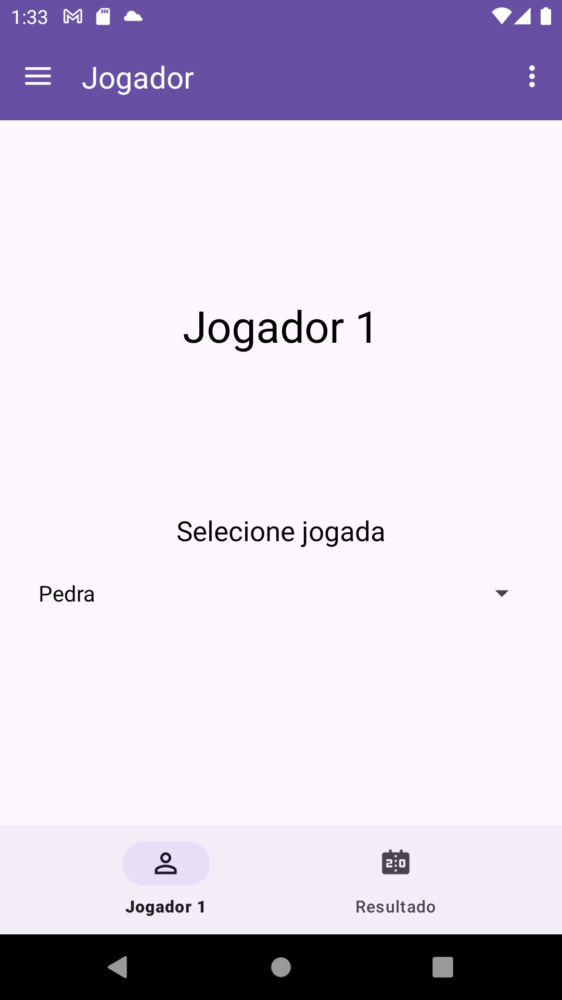
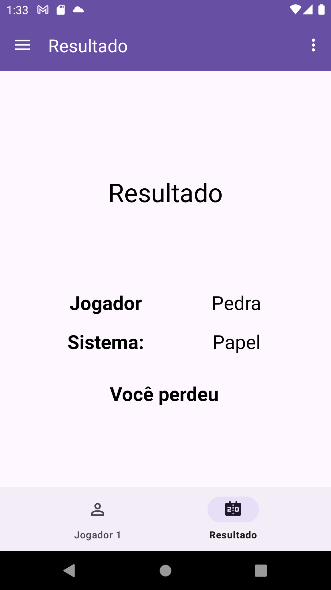
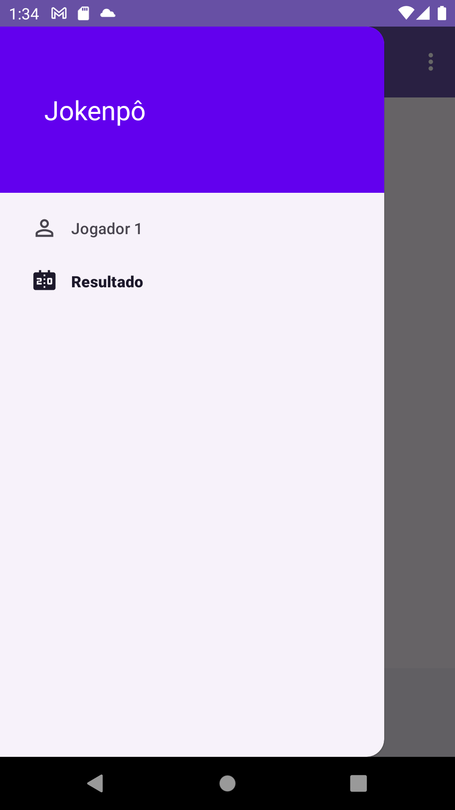

# Jokenpo

## Descrição do projeto

Aplicativo do clássico jogo "Pedra, Papel e Tesoura" (Jokenpô), com interface interativa e navegação entre telas.

## Tecnologias utilizadas

- Kotlin
- Navigation Component
- View Binding
- Material Design

## Screenshots

    
    
    
    

